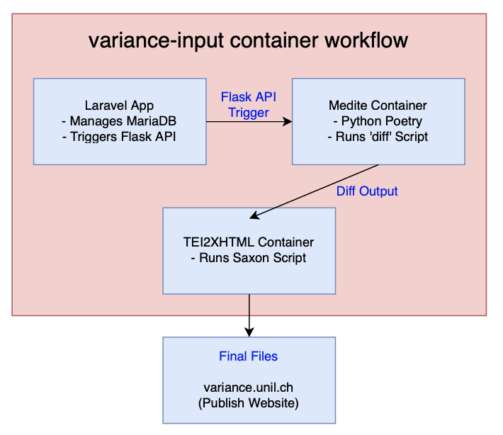

# Variance-Input (Development Server)

The purpose of this project is to streamline the workflow of researchers using the Medite literary comparison tool. It provides users with a single-point web application for:

- Importing and managing versions of literary texts stored in **TEI XML** format.
- Running **Medite** on these texts.
- Producing **publish-ready** files for integration into existing systems.

---

## Architecture

The webapp is built as a **Dockerized network of services**, as illustrated in the diagram below:



---

## Current Status

Development is currently ongoing, and this project is provided for **examination and testing purposes only**.

At this time you may:

### 1. Run the Medite container as a standalone service:
```bash
docker-compose up -d --build medite
```
Go to http://localhost:5000 to view the standalone Flask app.

### 2. Run the Saxon container as a standalone service:
```bash
docker-compose up -d --build saxon
```
Then access container:

```bash
docker-compose exec saxon bash
```

### 3. Run the Laravel container

At this time running the Laravel container requires some manual configuration. Use instructions below to configure and run Lavarel:

1. Duplicate .env.example file as .env and configure its db environment variables as defined in Docker Compose.

	```bash
	cp laravel/app/.env.example laravel/app/.env
	```

2. Edit Laravel Dockerfile so that container keeps running while running install commands. In file laravel/Dockerfile, replace this line:

	```bash
	CMD ["php", "artisan", "serve", "--host=0.0.0.0", "--port=8000"]
	```
	with:
	
	```bash
	CMD ["tail", "-f", "/dev/null"]
	```
	
3. Start containers
	
	```bash
	docker-compose -d --build up
	```
	
4. Access Laravel container

	```bash
	docker-compose exec laravel bash
	```

5. Install composer dependecies

	```bash
	composer install
	```
	
6. Generate application key

	```bash
	php artisan key:generate
	```

7. Run migrations

	```bash
	php artisan migrate
	```

8. Revert Laravel Dockerfile to run dev server upon container start. In file laravel/Dockerfile, replace:

	```bash
	CMD ["tail", "-f", "/dev/null"]
	```

	with

	```bash
	CMD ["php", "artisan", "serve", "--host=0.0.0.0", "--port=8000"]
	```

9. Rebuild and restart containers

	```bash
	docker-compose up laravel -d --build
	```
	
	Go to http://localhost:8000 to view Lavarel app.